# 01-basic-docker-trainings

## 1. Zarządzanie obrazami i kontenerami w Dockerze

### Pulling an image

`docker images` sprawdza dostępne obrazy  
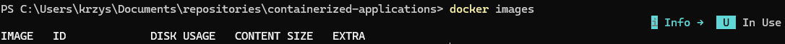

`docker search ubuntu` wyszukuje obrazy Ubuntu w Docker Hub  
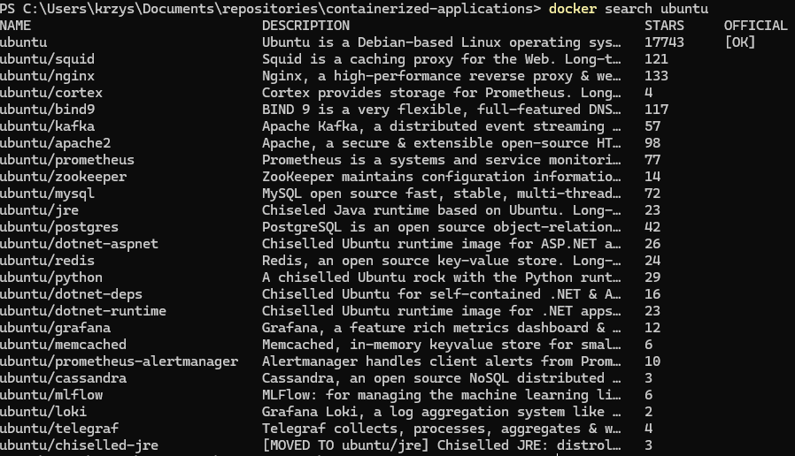

`docker pull ubuntu:22.04` pobiera obraz Ubuntu 22.04  
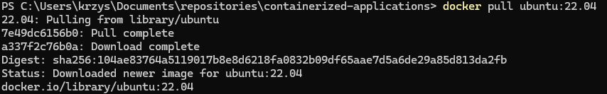

`docker pull ubuntu:22.10` pobiera obraz Ubuntu 22.10  
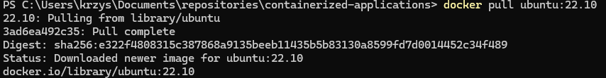

`docker images` pokazuje aktualną listę obrazów  
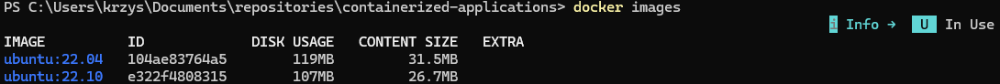

`docker rmi e322f4808315` usuwa konkretny obraz  
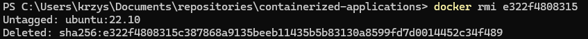

`docker images` ponownie pokazuje listę obrazów  
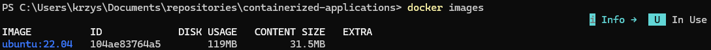

`docker rmi $(docker images -a -q)` usuwa wszystkie obrazy  
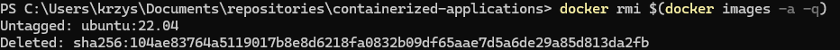

### Running our container

`docker run ubuntu:22.04 /bin/echo 'Hello world!'` uruchamia kontener i wyświetla wiadomość  
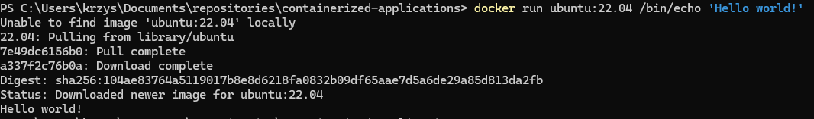

`docker ps` pokazuje działające kontenery  
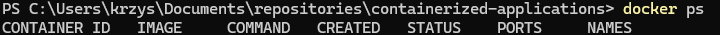

`docker ps -a` pokazuje wszystkie kontenery, w tym zatrzymane  
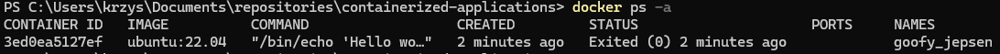

`docker run ubuntu:22.04 /bin/bash` uruchamia interaktywny kontener  
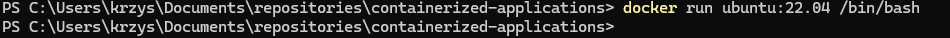

`docker run -it ubuntu:22.04 /bin/bash` uruchamia kontener w terminalu  
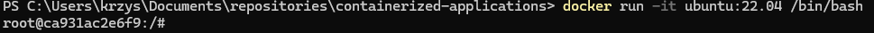

`docker run -d ubuntu:22.04 /bin/bash/sleep 3600` uruchamia kontener w tle  
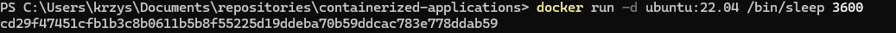

`docker exec -it cd2 /bin/bash` wchodzi do działającego kontenera  
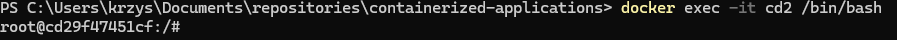

`ps aux` w kontenerze wyświetla procesy  
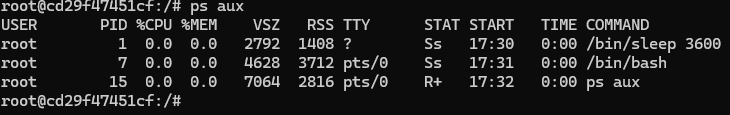

`exit` kończy sesję terminala kontenera, `docker ps` pokazuje jego stan  
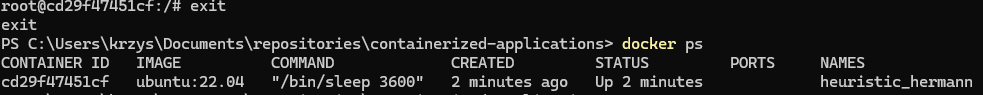

`docker stop cd29` zatrzymuje kontener  

### Removing containers

`docker rm $(docker ps -a -q)` usuwa wszystkie kontenery  

## 2. Zmiana obrazów

`docker run -it ubuntu:16.04 /bin/bash` i uruchomienie `ping google.com` oraz `apt-get update`  
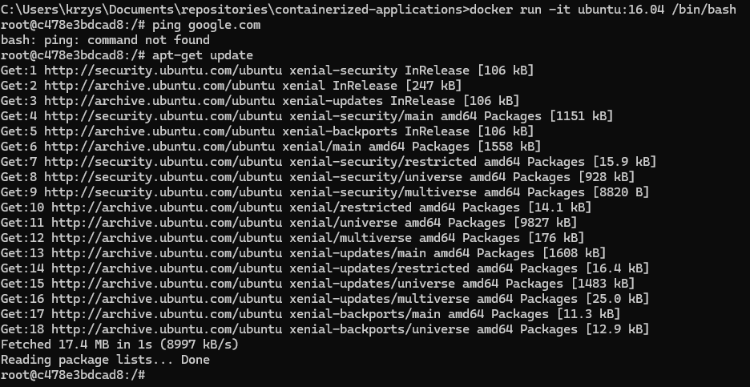

`apt-get install iputils-ping` aby zainstalować narzędzie ping  
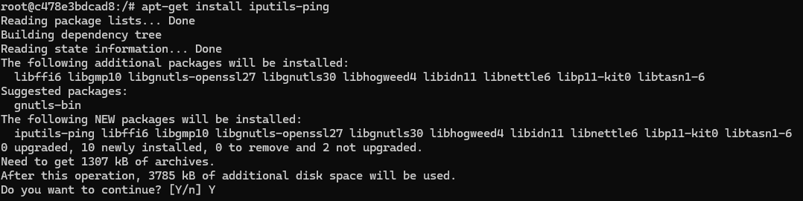

`ping google.com` - teraz działa poprawnie  
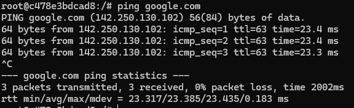

`docker commit -a "Krzysztof G" -m "Added ping utility." c47 delner/ping` tworzy nowy obraz z kontenera  
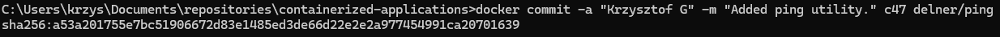

`docker images` pokazuje nowy obraz  

`docker run -it --rm delner/ping /bin/bash` i `ping google.com` działa w nowym obrazie  
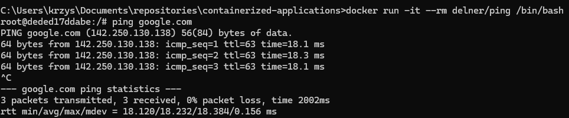

## 3. Budowanie obrazów

Dockerfile użyty do tworzenia obrazu  
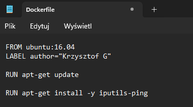

`docker build -t "delner/ping"` - budowanie obrazu  
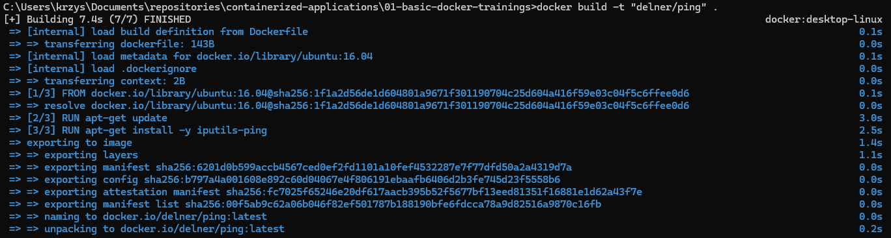

`docker images` - sprawdzenie dostępnych obrazów  
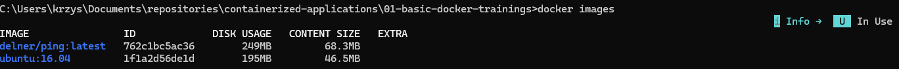

Dockerfile (kolejny przykład / wersja)  
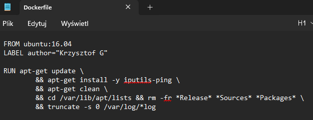

Dockerfile (jeszcze jeden przykład)  
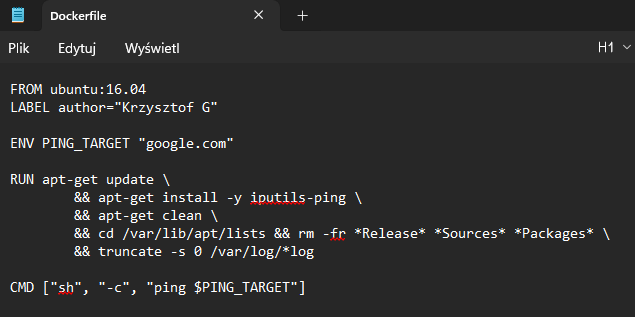

`docker run -it delner/ping` - uruchomienie kontenera z nowym obrazem  
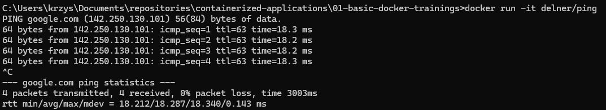

## 4. Udostępnianie obrazów

`docker push kg25127/ping:1.0` - wypchnięcie obrazu do Docker Hub  
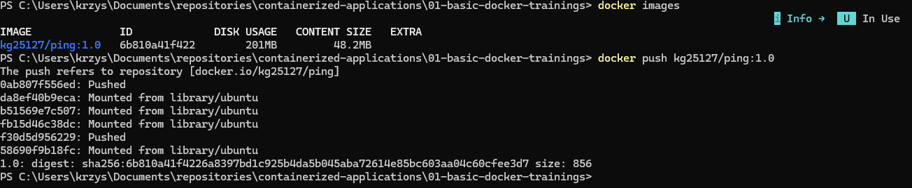

Widoczne zpushowane repozytorium na Docker Hub  
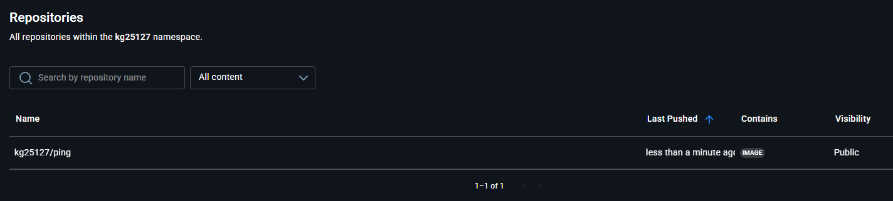

## 5. Wolumeny

`docker run --rm -d --name apache -p 80:80 httpd:2.4` i `curl localhost` - uruchomienie kontenera Apache i sprawdzenie serwera  
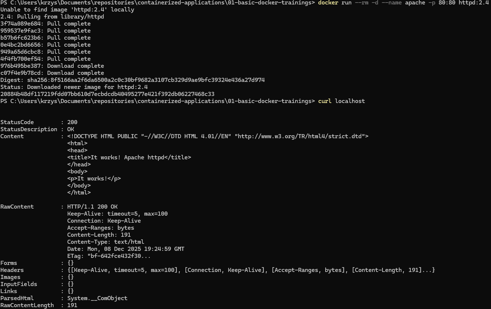

`notepad .\index.html` i `docker cp index.html apache:/usr/local/apache2/htdocs/` oraz `curl localhost` - kopiowanie pliku do kontenera i weryfikacja  
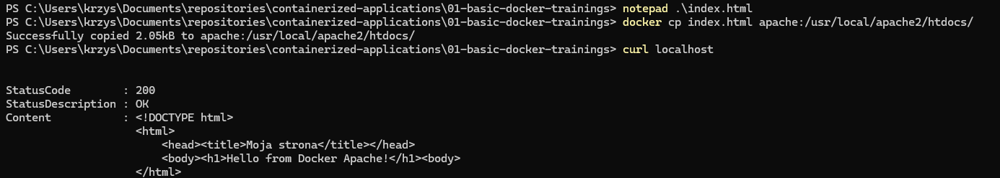

`docker stop apache` i ponowne uruchomienie kontenera `docker run --rm -d --name apache -p 80:80 httpd:2.4` oraz `curl localhost` - sprawdzenie zmian  
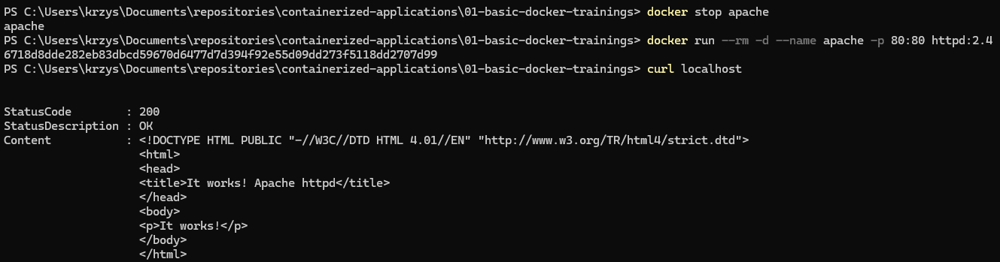

`docker volume ls`, `docker volume create`, `docker volume rm` - tworzenie i usuwanie wolumenów, m.in. `httpd_htdocs`  
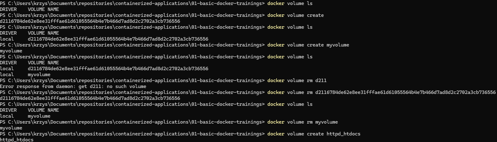

## 6. Sieci

`docker network ls` - lista dostępnych sieci Docker  
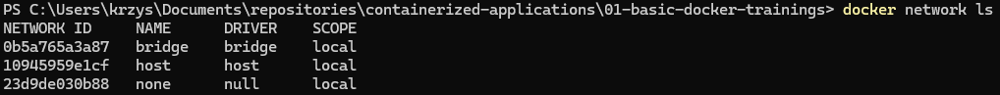

`docker network inspect bridge` - szczegóły sieci bridge  
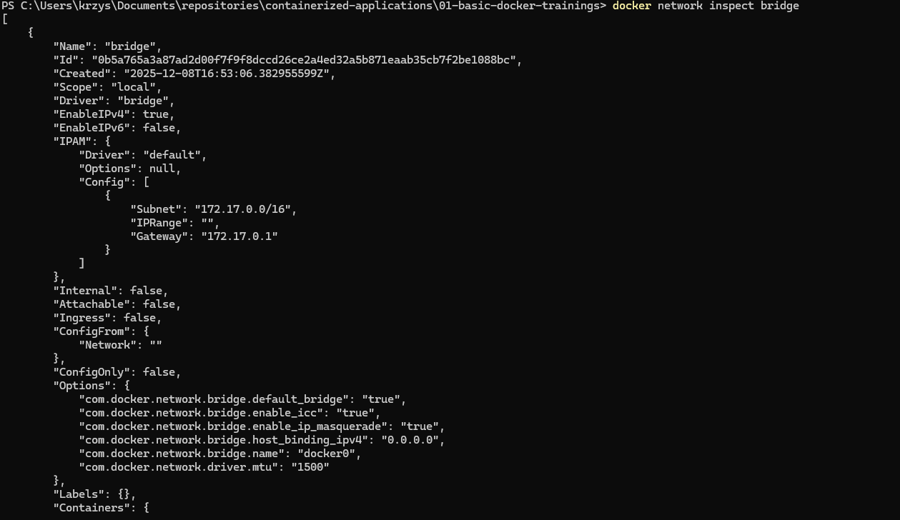

`docker run --rm -d --name dummy kg25127/ping:1.0` - uruchomienie kontenera dummy  
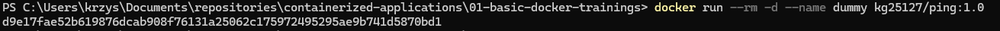

`docker run --rm -d -e PING_TARGET=172.17.0.2 --name pinger kg25127/ping:1.0`, `docker ps`, `docker logs pinger` - test połączenia z konkretnym adresem IP  
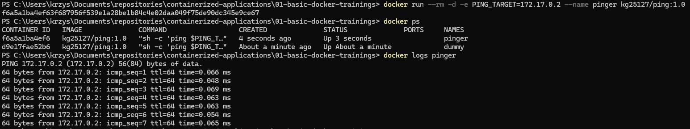

`docker run --rm -d -e PING_TARGET=dummy --name pinger kg25127/ping:1.0`, `docker ps` - test połączenia do kontenera po nazwie  
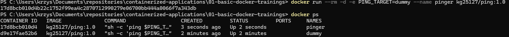

`docker network create skynet` i `docker network ls` - tworzenie nowej sieci i sprawdzenie listy  
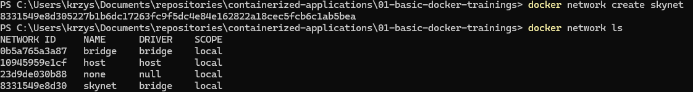

`docker network inspect skynet` - sprawdzenie szczegółów nowo utworzonej sieci  

`docker network rm skynet` i `docker network ls` - usunięcie sieci skynet  
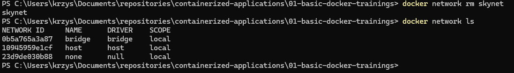

`docker network create skynet` i `docker run --rm -d --network skynet --name dummy kg25127/ping:1.0` - uruchomienie kontenera w nowej sieci  
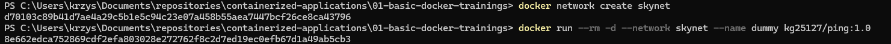

`docker run --rm -d --network skynet -e PING_TARGET=dummy --name pinger kg25127/ping:1.0`, `docker logs pinger` - test połączenia w nowej sieci  
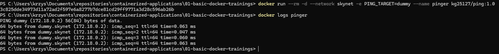

