# 03-devops-with-docker-part-1

## Section 1.

`docker container run hello-world` - uruchomienie prostego kontenera testowego, sprawdzenie instalacji Dockera  
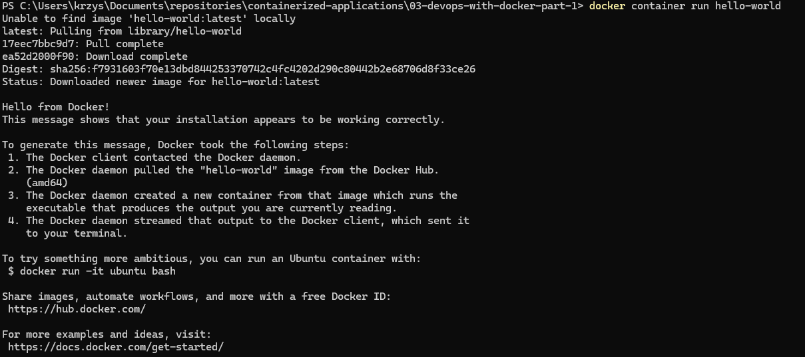

`docker container run -it ubuntu sh -c "apt update && apt install -y curl && curl https://www.google.com"` - uruchomienie Ubuntu, instalacja curl i sprawdzenie połączenia z Google  
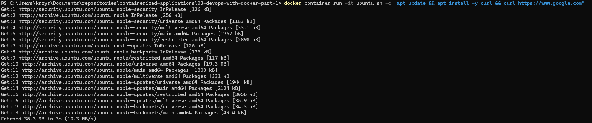

Wynik poprzedniego polecenia  
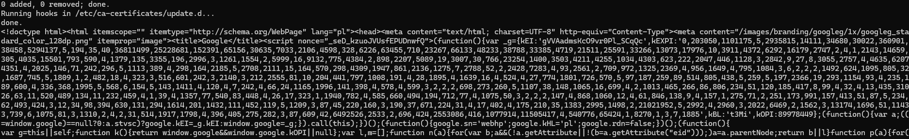

## Section 2.

`docker run ubuntu` – uruchomienie kontenera Ubuntu w domyślnym trybie  
`docker run -t ubuntu` – uruchomienie z pseudo-terminalem  
`docker run -it ubuntu` – uruchomienie interaktywne z terminalem  
`docker run -d -it --name looper ubuntu sh -c "while true; do date; sleep 1; done"` – kontener w tle z pętlą wyświetlającą datę  
`docker logs -f looper` – podgląd logów kontenera looper  
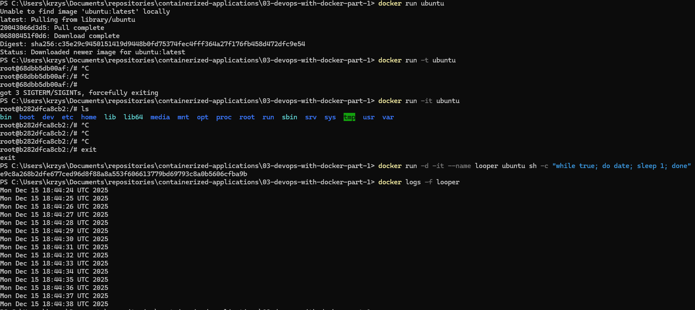

`docker attach looper` – podłączenie do działającego kontenera w drugim terminalu  
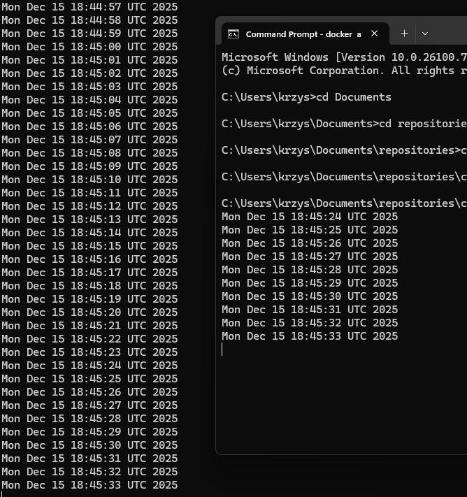

`docker attach --no-stdin looper` – podłączenie do kontenera bez stdin  
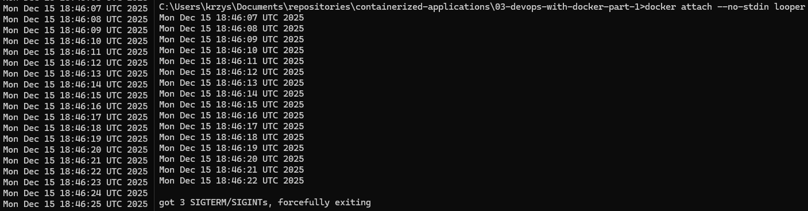

`docker exec looper ls -la` – wyświetlenie zawartości kontenera  
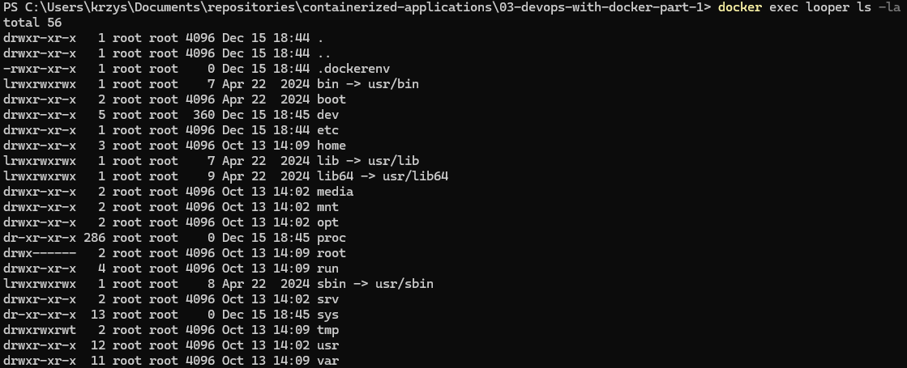

`docker exec -it looper bash` – uruchomienie bash w kontenerze  
`docker kill looper` – zatrzymanie kontenera  
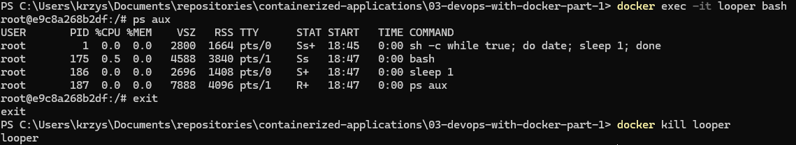

`docker run -d --rm -i --name looper-it ubuntu sh -c "while true; do date; sleep 1; done"` – uruchomienie kontenera w tle z auto-usuwaniem  
`docker attach looper-it` – podłączenie do kontenera  
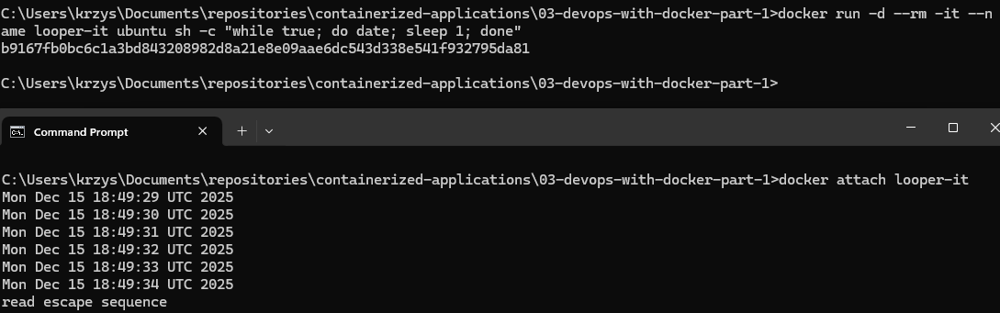

## Exercise 1.3

`docker exec -it secret bash` – podłączenie do kontenera  
`tail -f ./text.log` – wyświetlenie sekretnej wiadomości  
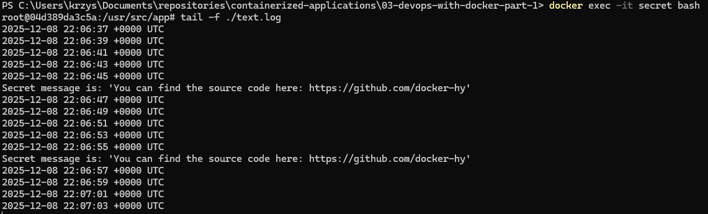

## Exercise 1.4

`sh -c 'while true; do echo "Input website:"; read website; echo "Searching.."; sleep 1; curl http://$website; done'` – skrypt do pobierania strony przez curl  
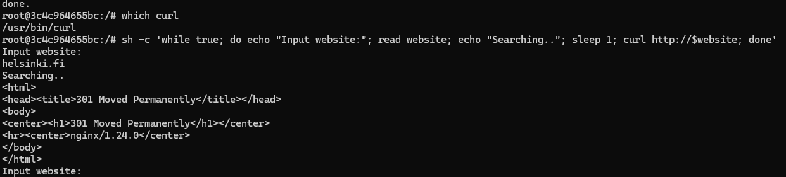

## Section 3.

`docker search hello-world` – wyszukiwanie obrazu hello-world  
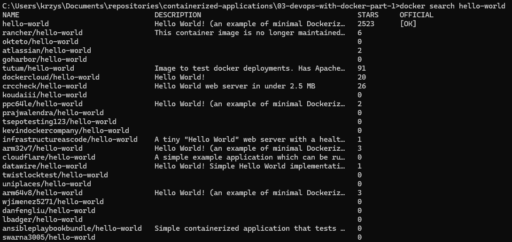

`docker build . -t hello-docker` – budowanie obrazu hello-docker  
`docker run hello-docker` – uruchomienie obrazu  
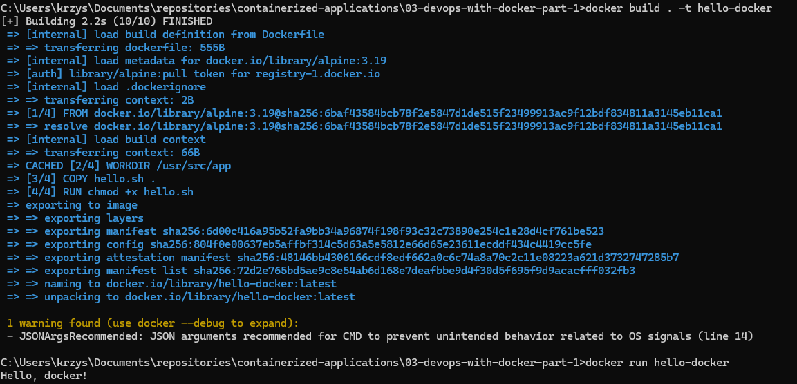

`docker ps` – lista działających kontenerów  
`docker cp ./additiona.txt adoring_kapitsa:/usr/src/app/` – kopiowanie pliku do kontenera  
`docker diff adoring_kapitsa` – sprawdzenie zmian w kontenerze  
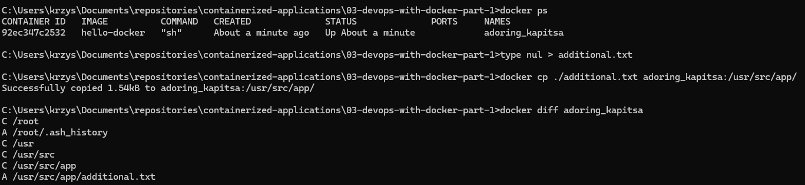

`docker run -it hello-docker sh` – uruchomienie shella w kontenerze  
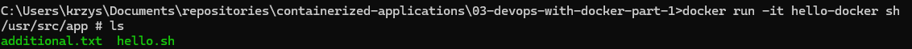

`docker commit adoring_kapitsa hello-docker-additional` – zapisanie zmian jako nowy obraz  
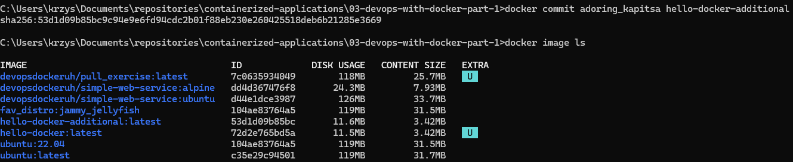

`docker run hello-docker-additional ls` – sprawdzenie zawartości nowego obrazu  
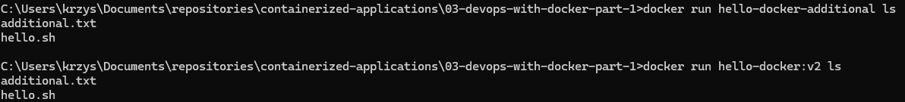

## Exercise 1.5

`docker image ls` – lista obrazów  
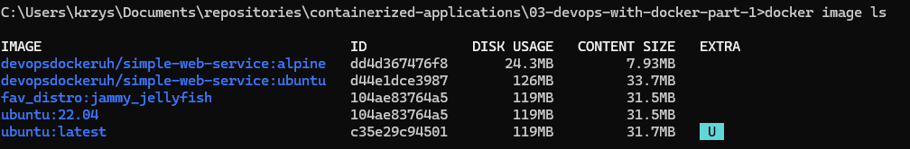

`docker run -it --name ubuntu_test devopsdockeruh/simple-web-service:ubuntu` – uruchomienie Ubuntu testowego kontenera  
`docker exec -it ubuntu_test sh` – podłączenie do kontenera  
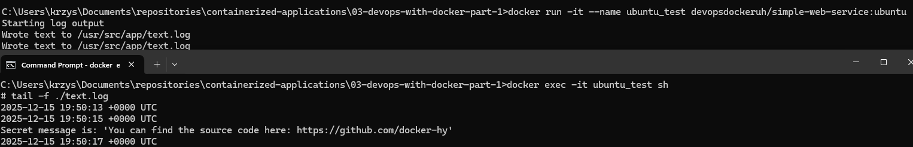

`docker run -it --name alpine_test devopsdockeruh/simple-web-service:alpine` – uruchomienie Alpine testowego kontenera  
`docker exec -it alpine_test sh` `tail -f ./text.log` – podgląd logów  
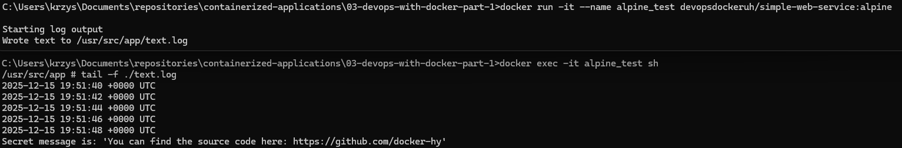

## Exercise 1.6

`docker run -it devopsdockeruh/pull_exercise` – uruchomienie ćwiczenia pull  
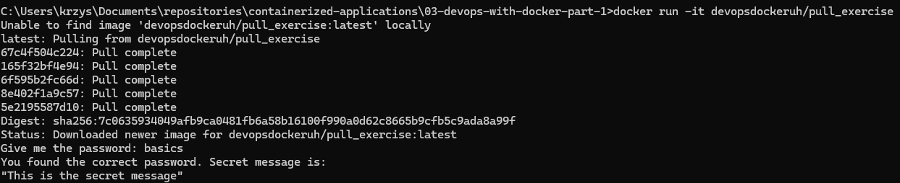

## Exercise 1.7

Dockerfile użyty do ćwiczenia  
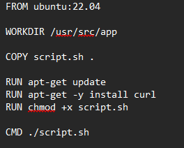

`docker run -it curler` – uruchomienie skryptu i podanie strony  
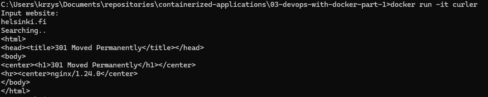

## Exercise 1.8

Dockerfile użyty do ćwiczenia  
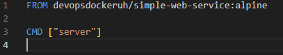

`docker build . -t web-server` – budowa obrazu web-server  
`docker run web-server` – uruchomienie kontenera  
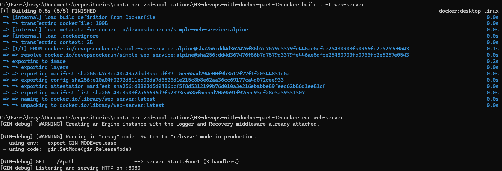

## Section 4.

Instalacja curl i Pythona w kontenerze – przygotowanie środowiska do pobierania plików  
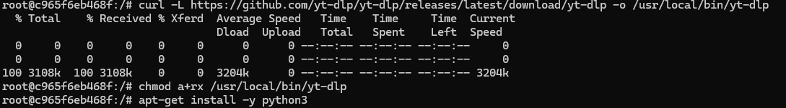

`docker run yt-dlp https://www.youtube.com/watch?v=XsqlHHTGQrw` – pobranie filmu z YouTube przy użyciu yt-dlp  

`docker run yt-dlp` – uruchomienie kontenera po ponownym zbudowaniu z ENTRYPOINT i CMD z domyślnym argumentem  
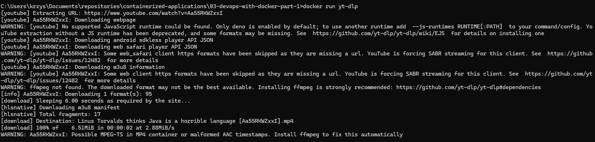

`docker cp "vigorous_elbakyan://mydir/Welcome to Kumpula campus! | University of Helsinki [DptFY_MszQs].mp4" .` – skopiowanie pobranego filmu z kontenera na komputer lokalny  
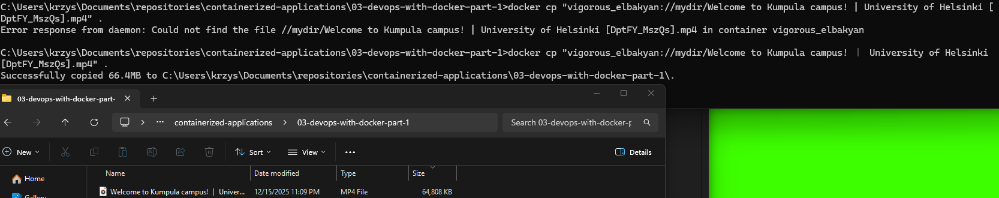

`docker run curler-v2 helsinki.fi` – ulepszony skrypt curler po zmianach w Dockerfile  
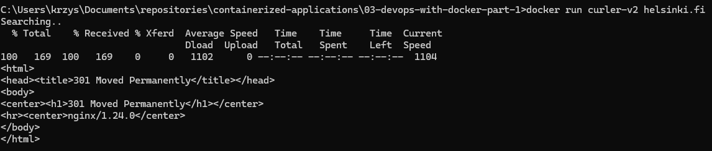

Zmieniony Dockerfile użyty do ulepszenia curlera  
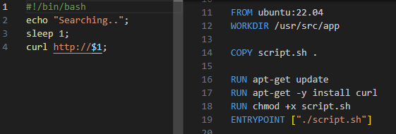

## Section 5.

`docker run -v "%cd%:/mydir" yt-dlp https://www.youtube.com/watch?v=DptFY_MszQs` – pobranie filmu z YouTube i zapisanie go bezpośrednio na komputerze lokalnym dzięki bind mount  
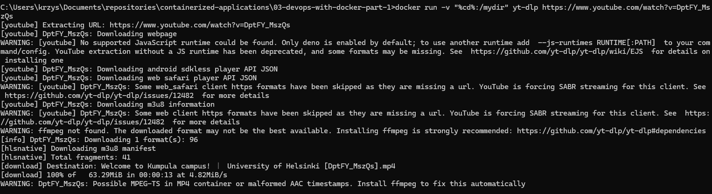

## Exercise 1.9

`docker run -d --name simplelogs devopsdockeruh/simple-web-service` – uruchomienie kontenera loggera w tle  
`docker cp simplelogs:/usr/src/app/text.log ./text.log` – skopiowanie wygenerowanych logów z kontenera na komputer lokalny  
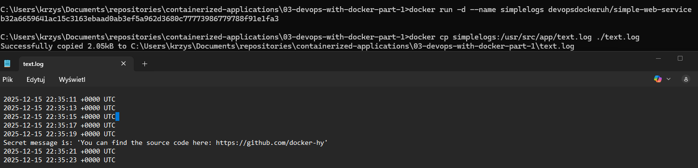

## Exercise 1.10

`docker run -p 8080:8080 simple-web-server` – uruchomienie kontenera web-server i udostępnienie go na porcie 8080, aby sprawdzić działanie w przeglądarce  
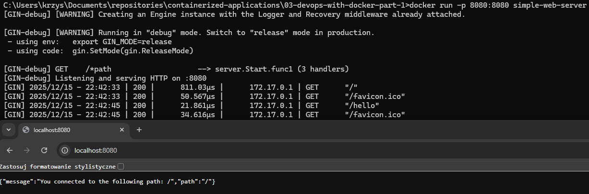

## Section 6.

`docker run -p 3000:3000 rails-project` – uruchomienie aplikacji Rails i udostępnienie jej na porcie 3000  
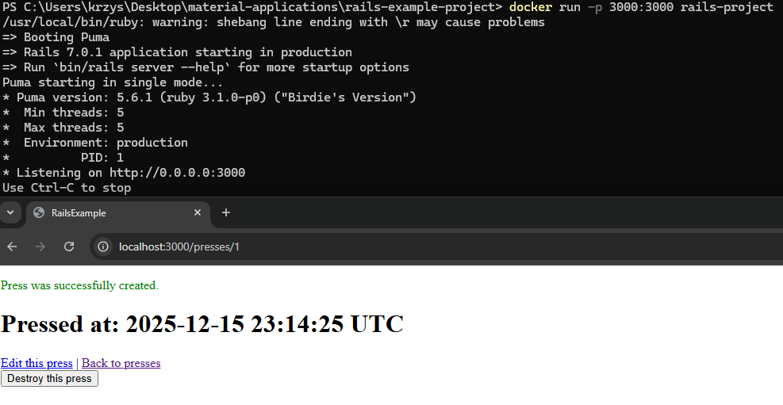

## Exercise 1.11

`docker run -p 8080:8080 spring-project` – uruchomienie projektu Spring i sprawdzenie działania w przeglądarce  
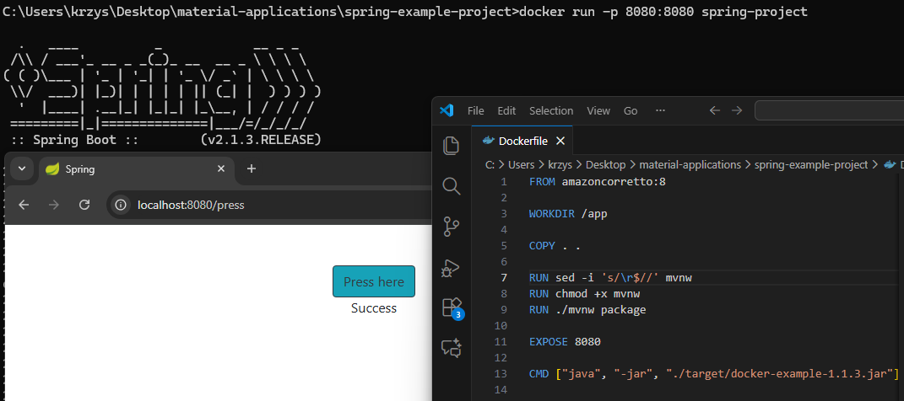

## Exercise 1.12

`docker run -p 5000:5000 example-frontend` – uruchomienie projektu frontendowego i sprawdzenie działania w przeglądarce  
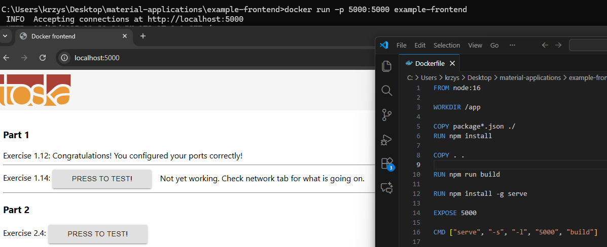

## Exercise 1.13

`docker run -p 8080:8080 example-backend` – uruchomienie backendu i sprawdzenie odpowiedzi pod endpointem /ping  
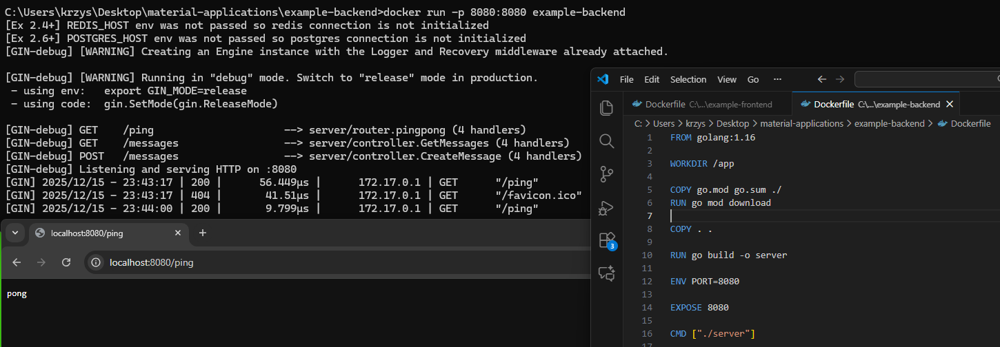

## Exercise 1.14

`docker build -t example-frontend --build-arg REACT_APP_BACKEND_URL=http://host.docker.internal:8080 .` – budowa obrazu frontendowego z konfiguracją połączenia do backendu  

`docker run -d -p 5000:5000 --name frontend example-frontend` – uruchomienie frontendu w tle  

`docker build -t example-backend .` – budowa obrazu backendu  

`docker run -d -p 8080:8080 --name backend example-backend` – uruchomienie backendu w tle  

Wynik działania
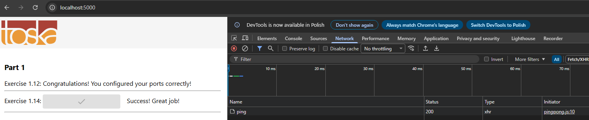

Dockerfile dla backendu  
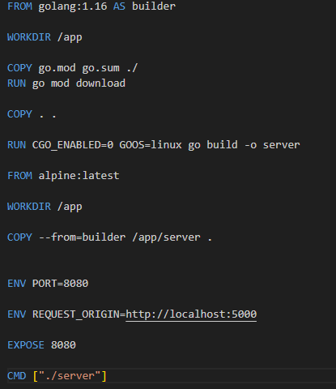

Dockerfile dla frontendu  
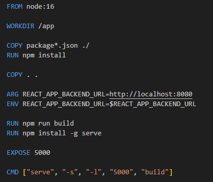

